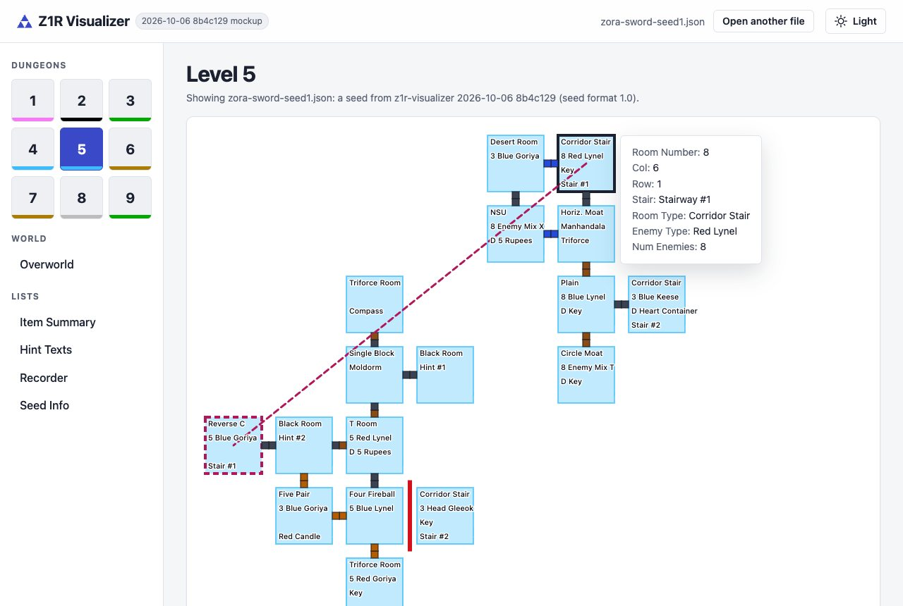
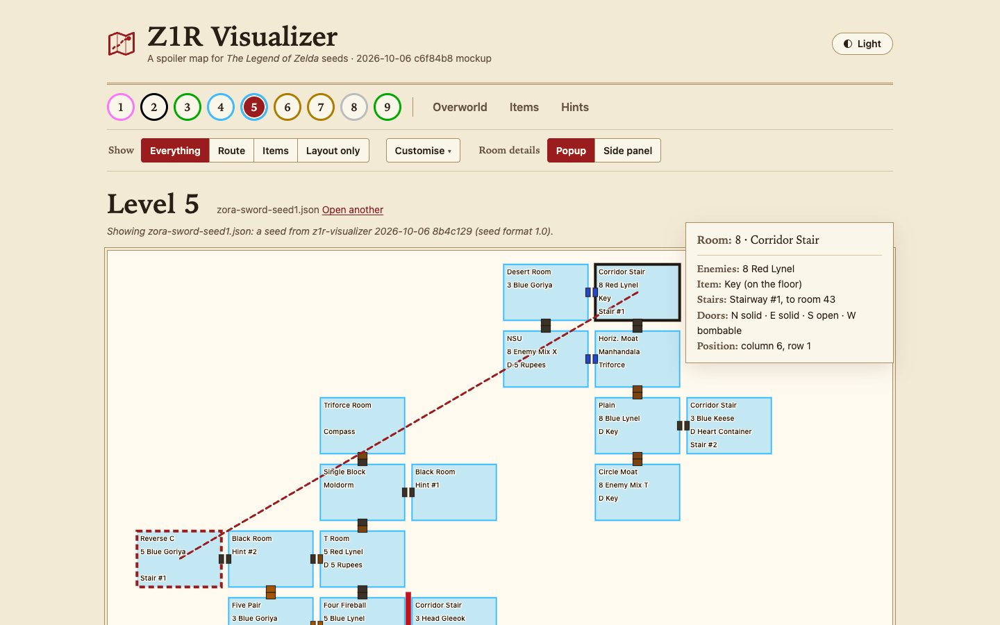
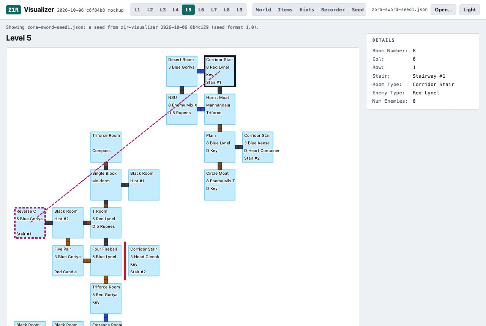

# Visual refresh: three design directions (stage 1, proposals)

Status (2026-10-06): the owner chose **B, Quest Log**, and it has had a second iteration
(below): an original mark in place of the triforce, rooms sized to fit every label, mode
toggles, and room details as a popup or in a side panel. The real page (`site/`) is still
unchanged; stage 2 applies the chosen design to it.

Each mockup is a working page, not a picture:
- the real renderer (`site/app.js`, `site/validate.js`), inside the direction's own shell and
  stylesheet;
- one real seed: ZORA magical-sword seed 1, exported with `cli.py --seed` into
  `sample-seed.json`.

So the maps, tooltips, room pinning, staircase pairs and Item Summary links all work.

Open the HTML files straight from disk:
- add `?empty` to the address to see the empty state;
- add `?theme=light` or `?theme=dark` to force a theme.

Mockups have no Python, so they open seed files (`.json`), not ROMs.

| Direction | Mockup | Single-file build, estimated |
|---|---|---|
| A. Atlas | [`mockup-atlas.html`](mockup-atlas.html) | about **137 KB** |
| B. Quest Log, iteration 2 | [`mockup-quest-log.html`](mockup-quest-log.html) | about **150 KB** |
| C. Tracker | [`mockup-tracker.html`](mockup-tracker.html) | about **134 KB** |

Today's single file is **119 KB**. Each direction adds 15-18 KB, almost all of it CSS. None
adds a font file: all three use the system's fonts, and B uses the system's serif for headings.
The estimate is today's single file with the stylesheet and shell swapped, plus the glue
(`mockup.js`).

## A. Atlas



A calm product layout with neutral surfaces and one indigo accent. A sidebar holds the nine
dungeons as a 3x3 grid of tiles, each underlined in its dungeon's colour, then the overworld and
the lists. Content sits in cards. The tool gets out of the way, and the dungeon colours do the
talking.

- Dark theme, Item Summary: [`atlas-desktop-dark.jpg`](atlas-desktop-dark.jpg).
- Phone: [`atlas-phone-dark.jpg`](atlas-phone-dark.jpg), [`atlas-phone-light.jpg`](atlas-phone-light.jpg) (empty state).
- **Layout:**
  - A sticky top bar: the name, the version chip, the open file with "Open another file", and the theme toggle.
  - On phones the sidebar becomes a scrolling strip under the top bar.
  - Empty state: a centred drop card with a "Choose a file" button, the supported ROMs, and the privacy line. A ROM or seed file can be dropped anywhere on the page.
- **Type:** system sans. A 1.25 scale from 16 px (12, 14, 16, 20, 25, 31 px), and a 4 px spacing grid.

## B. Quest Log



Game-flavoured but restrained: parchment and ink in light, a night palette in dark, and serif
headings. One centred column with a banner, then a sticky tab bar. Its dungeons are round coins
ringed in their colour, and its maps are framed like a sheet of the manual. It has the most
character of the three, but uses no images or custom fonts.

- Dark theme, Item Summary: [`quest-log-items-dark.jpg`](quest-log-items-dark.jpg).
- Phone: [`quest-log-phone-dark.jpg`](quest-log-phone-dark.jpg), [`quest-log-phone-light.jpg`](quest-log-phone-light.jpg) (empty state).
- **Layout:**
  - A banner with the name and version; the tabs scroll sideways on phones.
  - Empty state: a framed "Open a seed to explore it" card with a red call to action.
- **Type:**
  - The system's serif (Iowan Old Style, Palatino, Georgia) for headings, system sans for text.
  - A 1.25 scale with a larger 39 px display size, and a 4 px spacing grid.
  - Ledger-ruled tables.

### Quest Log, iteration 2

Open [`mockup-quest-log.html`](mockup-quest-log.html). Besides `?empty` and `?theme=`, it takes
`?details=popup` or `?details=panel`, and `?preset=everything`, `route`, `items` or `layout`.

**The mark.** The triforce is gone, from Atlas too. The new mark is an original drawing: a
folded map with a dashed route ending in a marker.

**Rooms that fit their text.** Labels were measured in the page's font, for every room type,
enemy, item and upgrade name the game can show.
- At the old size, rooms had 76 px for a label. "D Heart Container" needs about 95 px, and the
  widest, "D Boomerang Upgrade", 118 px.
- Level cells are now 132 x 96 px (wider than tall, since four lines fit easily), rooms fill
  more of them, and labels are 10 px. The longest label fits, and the map is 1056 px wide.
- East and west door markers moved into the gap between rooms, so they never sit on a label.
- The overworld's cells are 66 x 44 px with 13 px labels, so "Take Any" fits.
- Checked on three seeds (the sample, a Progressive Items seed and a Zelda Randomizer seed): in
  every level and the overworld, no label overflows its room or touches a door marker.
- A safety net for fonts that run wider on other systems: a label still too wide for its room is
  narrowed to fit, never spilling over (tested with an overlong label).

**Room details: popup or side panel.** Both are built; the "Room details" switch changes between
them, and the choice is remembered.
- **Popup** ([`quest-log-popup.jpg`](quest-log-popup.jpg)). The card sits beside the pinned room,
  or follows the cursor on hover. The map keeps the page's full width, so it fits without
  scrolling at 1180 px and wider. It does cover the rooms on one side of the pinned room.
- **Side panel** ([`quest-log-panel.jpg`](quest-log-panel.jpg)). A "Room ledger" panel to the
  right holds the hovered or pinned room's details, and never covers the map. It is a steadier
  place to read, but needs about 1400 px to show the full map beside it. In a 1280 px window the
  map scrolls sideways by about 140 px.
- On phones both become a sheet along the bottom, so nothing covers the map.
- The details card is fuller in both:
  - the room and its type, as a heading;
  - its enemies;
  - its item, and whether it lies on the floor or is dropped by the enemies;
  - its staircase, and the room it leads to, or its item cellar;
  - the door on each side;
  - its position.
- **Recommendation:** popup by default, with the side panel as the remembered option, as built.
  An "Auto" choice could pick the panel in windows of 1400 px or more.

**Mode toggles.** Above the maps: "Show: Everything · Route · Items · Layout only", a
"Customise" panel with the layers behind them, and the Room details switch.

| Preset | Shows |
|---|---|
| Everything | all of it, as today |
| Route | doors, staircases and major items; major-item rooms outlined in gold; no enemies, room types or minor items |
| Items | only the item labels, minor items left out; rooms without a major item faded ([`quest-log-mode-items-dark.jpg`](quest-log-mode-items-dark.jpg)) |
| Layout only | room types, doors and staircases, no items or enemies: the dungeon's shape without its spoilers |

- **Customise** ([`quest-log-mode-route-customise.jpg`](quest-log-mode-route-customise.jpg))
  switches each layer on its own:
  - room types, enemies, items, minor items (keys, bombs, rupees, maps, compasses, triforces);
  - transport staircases, door markers;
  - the gold outline and the fading.

  Changing a layer shows "Custom".
- Customise can also show the Recorder and Seed tabs, which are hidden by default since few
  seeds need them.
- Hidden layers leave their line empty, so the labels that remain keep their place in each
  room. Closing the gaps up instead is an easy change, if preferred.
- Everything is remembered per browser.
- The controls are native radio buttons and checkboxes, so keyboards and screen readers handle
  them, and Escape closes Customise.
- The gold outline passes the 3:1 contrast check in both themes, as do all of B's other colours.

**What stage 2 changes in the renderer** (the mockup patches it; `build_mockups.py` lists each
change):
- map cells that can be wider than tall;
- the room, label and door-marker geometry;
- classes on door markers, walls and the four kinds of label;
- the fuller details card.

The data each view shows stays byte-identical, so `check_site.mjs` and the ZORA hand-off are
unaffected.

## C. Tracker



A dense, dark-first tool for racers and testers. A compact top bar holds segmented controls (L1
to L9, World, Items, Hints, Recorder, Seed), and numbers are set in monospace. The map sits
beside a docked **Details** panel, where the hovered or pinned room's details stay put instead
of floating over the map. It fits the most on one screen.

- Dark theme, Item Summary: [`tracker-desktop-dark.jpg`](tracker-desktop-dark.jpg).
- Phone: [`tracker-phone-dark.jpg`](tracker-phone-dark.jpg), [`tracker-phone-light.jpg`](tracker-phone-light.jpg) (empty state).
- **Layout:**
  - On phones the controls wrap to their own scrolling row, and the Details panel becomes a sheet along the bottom while a room is hovered or pinned.
  - Empty state: one large dashed drop target.
- **Type:** a 1.2 scale from 14 px for density, with monospace for numbers, labels and table headings. Map labels stay in the system font, because monospace runs wider than the rooms.

## What all three share

- **Themes:**
  - Every colour is a `light-dark()` pair, defined once.
  - The page follows the system setting. A toggle cycles between system, light and dark, and remembers the choice per browser.
  - Browsers older than `light-dark()` (Chrome 123, Firefox 120, Safari 17.5) would need a light-only fallback in stage 2.
- **Maps:**
  - Rooms are tinted at about 30% of their dungeon's colour, so labels stay readable on any colour.
  - Labels have a halo in the map's background colour.
  - Door markers are outlined, so each type stands out on either background. In dark themes the map is dark too, and the door colours are lightened to match.
  - Pinned rooms, staircase pairs (dashed outline and line), hover and focus are each styled to fit the direction.
  - On phones, the tooltip of a pinned room becomes a sheet along the bottom, so it never covers the rooms around it.
- **Accessibility:**
  - `contrast.py` checks every direction in both themes against WCAG 2.2 AA. All checks pass.
    - **Text pairs** need 4.5:1. The tightest is secondary text on raised areas, at 5.4:1 or more.
    - **Focus rings, outlines, door markers and walls** need 3:1 against the map.
    - **Map labels** are checked against all 64 NES colours as a room fill: at least 5.6:1, even without their halo.
  - Visible focus everywhere: an outline on controls, a thicker outline on rooms.
  - A skip link. Navigation is plain buttons, with `aria-current` on the current view.
  - Checked with real key presses in Atlas: Tab reaches the toggle, the navigation and then the rooms, and Enter opens a view. A focused room shows its outline and tooltip. Enter to pin and Escape to unpin are the renderer's own code, checked on the real page.
- **No frameworks:** plain CSS custom properties, the existing JavaScript, and about 6 KB of glue for navigation, theme and drop handling.

## Stage 2 notes (for whichever is chosen)

- Give door markers and walls their own classes in `app.js`, instead of the attribute selectors
  the mockups use to recolour them. The data each view shows stays the same.
- Move the glue (navigation buttons, theme toggle, drop area) into the page's own script.
  The navigation stays bound to the renderer's views, so `check_site.mjs`'s comparisons keep
  working.
- The ZORA hand-off is untouched by any of this.

## Rebuilding

```bash
python3 docs/design/build_mockups.py
```

```bash
node docs/design/screenshots.mjs
```

```bash
python3 docs/design/contrast.py
```
